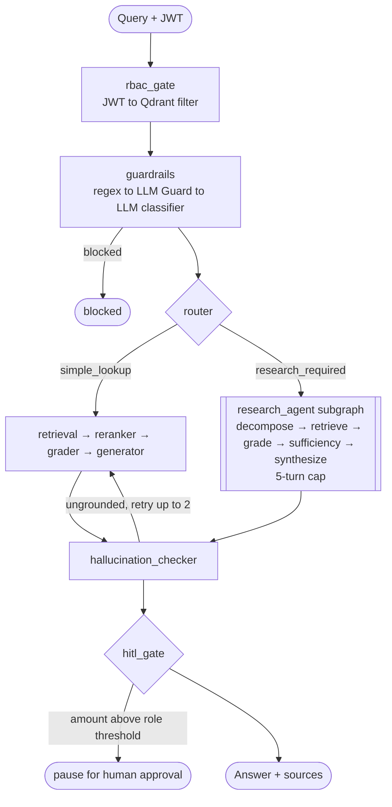

# FinanceBench RAG Agent

[](https://www.python.org/downloads/)
[](https://github.com/langchain-ai/langgraph)
[]()
[]()
[](LICENSE)

A multi-agent RAG system for role-based access-controlled financial document Q&A. Achieves **72.7% correctness pass rate** on the public FinanceBench benchmark using selective agentic retrieval, a LoRA-fine-tuned reranker, and a self-hosted LLM observability stack.

## Architecture



A router classifies each query as a simple lookup or research-required. Simple lookups take the fast direct path; research queries enter a multi-turn subgraph that decomposes the question, retrieves per sub-question, grades sufficiency, and synthesizes a final answer. RBAC is enforced at the Qdrant payload-filter level — agentic queries cannot bypass access control. High-stakes answers (above a per-role dollar threshold) pause via LangGraph's `interrupt()` for human approval, with state checkpointed to Postgres.

## Tech stack

- **Backend** — FastAPI · LangGraph · Qdrant · PostgreSQL · Redis · PyJWT
- **Frontend** — Next.js 16 · React 19 · Tailwind · shadcn/ui  *(in progress; Gradio is the current usable UI)*
- **LLMs** — Claude Sonnet 4.6 · gpt-4o-mini · Llama 3.3 (via Groq)
- **Retrieval** — voyage-finance-2 embeddings · LoRA-fine-tuned BGE-reranker-v2-m3
- **Observability** — self-hosted LiteLLM proxy + Langfuse v3 + Redis semantic cache
- **Safety** — Microsoft Presidio PII detection · LLM Guard · LLM classifier (3-layer cascade)
- **Evaluation** — RAGAS · DeepEval · custom LLM correctness judge

## Evaluation results

Evaluated on the FinanceBench benchmark (150 questions across 32 companies):

| Metric | Value |
|---|---|
| Correctness pass rate | **72.7%** (109/150) |
| Refusal rate | 6.7% (10/150) |
| RAGAS faithfulness | 0.747 |
| DeepEval faithfulness | 0.844 |
| DeepEval contextual recall | 0.768 |

Per-slice pass rate: **lookup 68.6%** (n=86), **multi-hop 84.6%** (n=13), **calc 76.5%** (n=51).

The correctness judge is a Claude Sonnet 4.6 + structured-prompt setup calibrated to Cohen's κ = 0.932 against an 89-question hand-labeled set with an adversarial leniency guard. The evaluation pipeline uses three judges in parallel (RAGAS, DeepEval, custom correctness), per-question diagnostics, reproducibility-metadata snapshots on every run, and a decision-gated approach in which each candidate intervention must clear an empirically-measured noise floor before shipping. Full methodology, per-judge scores, and reproduction commands in [docs/evaluation.md](docs/evaluation.md).

## Known limitations

- **Not deployed to production** — runs locally via `docker compose up -d`. No public URL or live traffic.
- **Frontend is a vertical slice** — login + streaming chat work; sidebar, HITL UI, admin panel, citation PDF viewer are unbuilt.
- **Below the top-published Mafin (~99%)** on FinanceBench, though above FinanceBench paper baselines (38–43%) and [FinGEAR EMNLP 2025](https://arxiv.org/abs/2410.18141) GraphRAG (~55%).

## Quick start

```bash
git clone https://github.com/Rishabhmannu/financebench-rag-agent.git
cd financebench-rag-agent
pip install -e ".[dev]" && cp .env.example .env   # add your API keys
docker compose up -d && make run                  # API at http://localhost:8000
```

Full setup, test accounts, dev commands, and API surface in [docs/setup.md](docs/setup.md).

## Documentation

- [docs/evaluation.md](docs/evaluation.md) — Methodology, results, reproduction
- [docs/engineering-log.md](docs/engineering-log.md) — Engineering decisions and tradeoffs
- [docs/setup.md](docs/setup.md) — Local development, test accounts, environment
- [docs/architecture.md](docs/architecture.md) · [docs/api-reference.md](docs/api-reference.md) · [docs/rbac-matrix.md](docs/rbac-matrix.md) · [web/README.md](web/README.md)

## License

MIT
