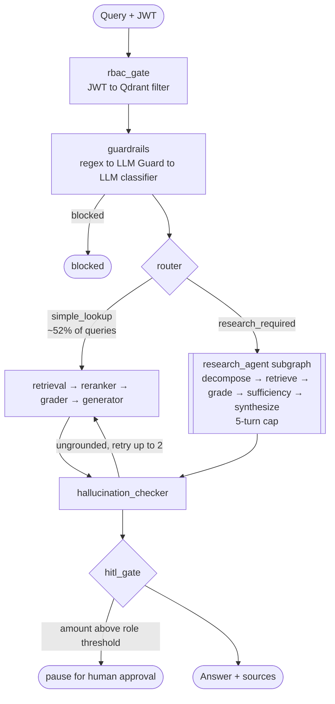

# FinanceBench RAG Agent

[](https://www.python.org/downloads/)
[](https://github.com/langchain-ai/langgraph)
[]()
[]()
[](LICENSE)

> Multi-agent LangGraph RAG for financial document Q&A — **47.3% on FinanceBench through evaluation discipline, not vibes**. RBAC at the vector layer, HITL on high-stakes answers, self-hosted LLM observability stack.

## Headline

On the public **FinanceBench** benchmark (150 questions across 32 companies), pass rate trajectory across four eval-quality sprints: **30.7% → 47.3% (+16.6pp)**. Per-eval cost reduced **46%** ($9.70 → $5.28). Multi-hop slice — stuck at 4/13 across three retrieval interventions — finally moved to 6/13 after a LoRA-fine-tuned reranker on FinanceBench correctness labels. **Six interventions tested in total; three shipped, three documented null results rolled back behind feature flags.** The methodology caught the failures cleanly and preserved the wins.

Deep dives: [evaluation methodology and full results](docs/evaluation.md) · [engineering log](docs/engineering-log.md).

## Architecture



**Selective agentic RAG**: the router classifies each query as `simple_lookup` (most of FinanceBench) or `research_required`. Lookup queries take the fast direct path; research queries enter a multi-turn subgraph that decomposes the question, retrieves per sub-question, grades sufficiency, and synthesizes a final answer. Both paths share the same RBAC-filtered retrieval node — agentic queries cannot bypass access control.

## Tech stack

| Layer | Technology |
|---|---|
| Orchestration | LangGraph 0.6 — StateGraph, conditional edges, `interrupt()`, PostgresSaver checkpointer |
| Backend | FastAPI + SSE streaming · PyJWT auth with 5 roles |
| Frontend | Next.js 16 + React 19 + Tailwind 4 + shadcn/ui (Sprint 9.1 vertical slice; Gradio still live as legacy) |
| Vector DB | Qdrant — RBAC enforced via payload metadata filters at query time |
| Generator | Claude Sonnet 4.6 (Anthropic) |
| Verification | Claude Haiku 4.5 (hallucination check) — Sprint 7.9 tier downgrade |
| Decompose / Sufficiency | gpt-4o-mini — Sprint 7.9 tier downgrade |
| Router / Grader / Query rewriter | Llama 3.3 70B on Groq (free) → gpt-4o-mini fallback |
| Embeddings | voyage-finance-2 (1024d, finance-tuned) — canonical from Sprint 7.8 |
| Reranker | BGE-reranker-v2-m3 + LoRA adapter (Sprint 7.9 fine-tune on FinanceBench labels) |
| Gateway / Observability | LiteLLM proxy → self-hosted Langfuse v3 (postgres + redis + clickhouse + minio + worker + web) |
| Semantic cache | Redis Stack (RediSearch) via LiteLLM `redis-semantic` at 0.95 cosine threshold |
| PII / injection | Microsoft Presidio + LLM Guard + LLM classifier (3-layer cascade) |
| Evaluation | RAGAS + DeepEval + LLM correctness judge — all gpt-4o-mini |

## Evaluation results

Full methodology and per-slice breakdown in [docs/evaluation.md](docs/evaluation.md). Headline trajectory:

| Sprint | Intervention | Pass rate | Δ | Status |
|---|---|:---:|:---:|:---:|
| 7.6 Day 1 | Claude Sonnet 4.6 baseline | 30.7% | — | baseline |
| 7.6 Day 4 | + selective agentic RAG | **38.7%** | +8.0pp | shipped |
| 7.7 Day 6 | + text-embedding-3-large | **43.3%** | +4.6pp | shipped |
| 7.7 Day 7 | grader empty-context fallback | — | null | rolled back |
| 7.7 Day 8 | Doc2Query BM25 enrichment | — | null | rolled back |
| 7.8 Day 16 | + voyage-finance-2 embeddings | **44.7%** | +1.4pp | shipped |
| 7.8 Day 19 | calculator tool | 40.7% | **−4.0pp** | rolled back |
| 7.9 Day 3 | + heterogeneous model tiering | — | matches noise | shipped |
| **7.9 Day 7** | **+ LoRA-fine-tuned BGE reranker** | **47.3%** | **+2.7pp** | **shipped** |

Refusal rate halved (14.0% → 7.3%). Per-eval cost dropped 46% ($9.70 → $5.28). The multi-hop slice — stuck at 4/13 across four prior interventions — moved to 6/13 after the reranker fine-tune (+15pp on slice).

The Sprint 7.9 Day 2.5 noise-floor measurement (±3 net pass-count at n=30 dev-set under identical config) is the campaign's most important methodological finding: most engineers blindly trust dev-set deltas; measuring the noise floor on the same baseline is what catches the false positives and negatives. See [docs/evaluation.md](docs/evaluation.md#dev-set-noise-floor-calibration).

## Known limitations

Things this project is NOT, said out loud so a reader doesn't have to guess.

1. **Never deployed to production.** The full stack runs locally via `docker compose up -d`. No public URL, no real user traffic. `.github/workflows/deploy.yml` exists but has not been used.
2. **47.3% is below SOTA.** [FinGEAR (EMNLP 2025)](https://arxiv.org/abs/2410.18141) achieved ~55% on FinanceBench with GraphRAG. Patronus's original baselines were 38–43%. The project sits credibly in the published-baseline range, well below state-of-the-art.
3. **Frontend (Sprint 9) is partial.** Vertical slice (login + streaming chat + sources + theme + user header) is built and the BFF wiring works against the backend; sidebar history, HITL approval UI, admin panel, citation PDF viewer, and file upload are unbuilt. The Gradio app is the current usable UI.
4. **Multi-judge eval uses one model family.** RAGAS + DeepEval + correctness all run on gpt-4o-mini. `scripts/dual_judge_check.py` re-scores a sample with a second judge family as a manual cross-check, but it's not a CI gate.
5. **Feature-flagged experiments preserved in source.** `ENABLE_GRADER_EMPTY_CONTEXT_FALLBACK`, `ENABLE_LTR_GATE`, `ENABLE_CALCULATOR_TOOL` are all `=False`. Preserved as research record; adds surface area to the repo.
6. **No production ops.** No load testing, no horizontal scaling validation, no incident runbooks.

### What I'd build next, in priority order

1. **Deploy backend + frontend on free-tier infra** (Render + Vercel + Neon Postgres). Closes the biggest credibility gap.
2. **Finish Sprint 9.2** — thread sidebar + HITL approval UI is the most user-visible feature still missing.
3. **GraphRAG experiment** — likely the largest single quality lever remaining. FinGEAR's +8pp over baseline RAG suggests this is where the ceiling is.

## Quick start

```bash
git clone https://github.com/Rishabhmannu/financebench-rag-agent.git
cd financebench-rag-agent
pip install -e ".[dev]"
cp .env.example .env       # fill in OPENAI_API_KEY, ANTHROPIC_API_KEY, JWT_SECRET
docker compose up -d       # Qdrant + Postgres + Sprint 8 observability stack
python scripts/download_sample_data.py
python scripts/seed_qdrant.py --sample
make run                   # API at http://localhost:8000
make frontend              # Gradio at http://localhost:7860
```

For Next.js frontend, full setup instructions, test accounts, and API surface, see [docs/setup.md](docs/setup.md).

## Documentation

- [docs/evaluation.md](docs/evaluation.md) — Full evaluation methodology, FinanceBench trajectory, SEC 61-Q internal results, pypdf vs docling A/B, reproduction commands
- [docs/engineering-log.md](docs/engineering-log.md) — The condensed engineering narrative: noise-floor finding, calculator regression diagnosis, LoRA reranker, observability stack rationale, honest limitations
- [docs/architecture.md](docs/architecture.md) — Graph topology, node responsibilities, state management
- [docs/rbac-matrix.md](docs/rbac-matrix.md) — Role permissions, confidentiality levels, HITL thresholds
- [docs/api-reference.md](docs/api-reference.md) — Endpoint request/response examples
- [docs/setup.md](docs/setup.md) — Quick start, test accounts, dev commands, env vars, full API surface
- [docs/research/](docs/research/) — Feasibility research notes
- [web/README.md](web/README.md) — Next.js frontend architecture and pitfalls

## License

MIT
