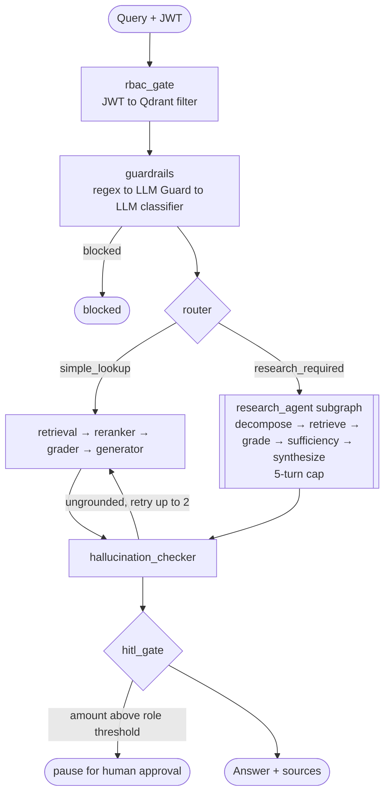

# FinanceBench RAG Agent

[](https://pypi.org/project/financebench-rag-agent/)
[](https://www.python.org/downloads/)
[](https://github.com/langchain-ai/langgraph)
[]()
[]()
[](LICENSE)

A multi-agent RAG system for role-based access-controlled financial document Q&A. Achieves **72.7% correctness pass rate** on the public FinanceBench benchmark using selective agentic retrieval, a BGE cross-encoder reranker, and a self-hosted LLM observability stack.

## Try it

```bash
pip install financebench-rag-agent
financebench setup     # brings up the 4-service docker stack, seeds a sample corpus
financebench login -u analyst    # password analyst123
financebench chat
```


Multi-party HITL approval workflow and conversation memory have their own walkthroughs in [docs/cli.md](docs/cli.md). Self-hosting the backend (env vars, full vs minimal stack, production hardening) is in [docs/deploy.md](docs/deploy.md).

## Architecture


```mermaid
flowchart TD
    Q([Query + JWT]) --> RBAC[rbac_gate<br/>JWT to Qdrant filter]
    RBAC --> Guard[guardrails<br/>regex to LLM Guard to LLM classifier]
    Guard -->|blocked| Block([blocked])
    Guard --> Route{router}
    Route -->|simple_lookup| Direct[retrieval → reranker → grader → generator]
    Route -->|research_required| Agent[[research_agent subgraph<br/>decompose → retrieve → grade → sufficiency → synthesize<br/>5-turn cap]]
    Direct --> Halu[hallucination_checker]
    Agent --> Halu
    Halu -->|ungrounded, retry up to 2| Direct
    Halu --> HITL{hitl_gate}
    HITL -->|amount above role threshold| Pause([pause for human approval])
    HITL --> Out([Answer + sources])
```

A router classifies each query as a simple lookup or research-required. Simple lookups take the fast direct path; research queries enter a multi-turn subgraph that decomposes the question, retrieves per sub-question, grades sufficiency, and synthesizes a final answer. RBAC is enforced at the Qdrant payload-filter level — agentic queries cannot bypass access control. High-stakes answers (above a per-role dollar threshold) pause via LangGraph's `interrupt()` for human approval, with state checkpointed to Postgres.

## Tech stack

- **Backend** — FastAPI · LangGraph · Qdrant · PostgreSQL · Redis · PyJWT
- **Client** — `financebench` CLI: typer · rich · prompt_toolkit · httpx-sse · token-streaming over SSE
- **Frontend** — Next.js 16 · React 19 · Tailwind · shadcn/ui  *(in progress; CLI is the canonical client)*
- **LLMs** — Claude Sonnet 4.6 · gpt-4o-mini · Llama 3.3 (via Groq)
- **Retrieval** — voyage-finance-2 embeddings · BGE-reranker-v2-m3 cross-encoder
- **Observability** — self-hosted LiteLLM proxy + Langfuse v3 + Redis semantic cache
- **Safety** — Microsoft Presidio PII detection · LLM Guard · LLM classifier (3-layer cascade)
- **Evaluation** — RAGAS · DeepEval · custom LLM correctness judge

## Evaluation results

Evaluated on the FinanceBench benchmark (150 questions across 32 companies):

| Metric | Value |
|---|---|
| Correctness pass rate | **72.7%** (109/150) |
| Refusal rate | 6.7% (10/150) |
| RAGAS faithfulness | 0.747 |
| DeepEval faithfulness | 0.844 |
| DeepEval contextual recall | 0.768 |

Per-slice pass rate: **lookup 68.6%** (n=86), **multi-hop 84.6%** (n=13), **calc 76.5%** (n=51).

The correctness judge is a Claude Sonnet 4.6 + structured-prompt setup calibrated to Cohen's κ = 0.932 against an 89-question hand-labeled set with an adversarial leniency guard. Full methodology, per-judge scores, and reproduction commands in [docs/evaluation.md](docs/evaluation.md).

## Comparison with published systems on FinanceBench

| System | Approach | Accuracy |
|---|---|---:|
| [Mafin 2.5 / PageIndex](https://github.com/VectifyAI/Mafin2.5-FinanceBench) | Vectorless reasoning over hierarchical document tree | **98.7%** |
| [DANA](https://arxiv.org/abs/2410.02823) | Domain-aware neurosymbolic agent with deterministic operators | 94.3% |
| GPT-4-Turbo · long context (128k) | Whole-document prompting | ~79% |
| Claude-2 · long context (100k) | Whole-document prompting | ~76% |
| **This project** | Multi-agent RAG with selective research-agent subgraph + RBAC + HITL | **72.7%** |
| [FinanceBench paper](https://arxiv.org/abs/2311.11944) baselines | Vector retrieval + GPT-4 / Llama-2 | 38–43% |
| GPT-4-Turbo · top-k vector RAG | Standard retrieval, no agent | ~19% |

Long-context approaches score higher but are not enterprise-deployable — 10-K filings frequently exceed 128k tokens, and whole-document prompting is impractical at scale due to latency and cost. The 72.7% here is measured on a production-shaped pipeline (fixed institutional corpus, batched retrieval, RBAC at the storage layer, HITL on high-stakes outputs).

## Known limitations

- **Not deployed to production** — runs locally via `docker compose up -d`. No public URL or live traffic.
- **Frontend is a vertical slice** — login + streaming chat work; sidebar, HITL UI, admin panel, citation PDF viewer are unbuilt.
- **Below the top-published systems** (Mafin 2.5 at 98.7%, DANA at 94.3%) — see comparison table above for context.

## Running from source

```bash
git clone https://github.com/Rishabhmannu/financebench-rag-agent.git
cd financebench-rag-agent
pip install -e ".[cli,dev]" && cp .env.example .env   # add your API keys
financebench setup                                     # docker compose + seed corpus
```

For self-hosting the full 11-service stack (LiteLLM + Langfuse), upgrade flows, and production hardening, see [docs/deploy.md](docs/deploy.md) and [docs/upgrade.md](docs/upgrade.md).

## Documentation

- [docs/cli.md](docs/cli.md) — CLI reference, slash commands, multi-party HITL workflow
- [docs/deploy.md](docs/deploy.md) — Self-host: stack profiles, env vars, backup, hardening
- [docs/upgrade.md](docs/upgrade.md) — Upgrade cookbook by change type
- [docs/evaluation.md](docs/evaluation.md) — Methodology, results, reproduction
- [docs/engineering-log.md](docs/engineering-log.md) — Engineering decisions and tradeoffs
- [docs/setup.md](docs/setup.md) — Test accounts, environment, dev commands
- [docs/architecture.md](docs/architecture.md) · [docs/api-reference.md](docs/api-reference.md) · [docs/rbac-matrix.md](docs/rbac-matrix.md) · [web/README.md](web/README.md)

## License

MIT
